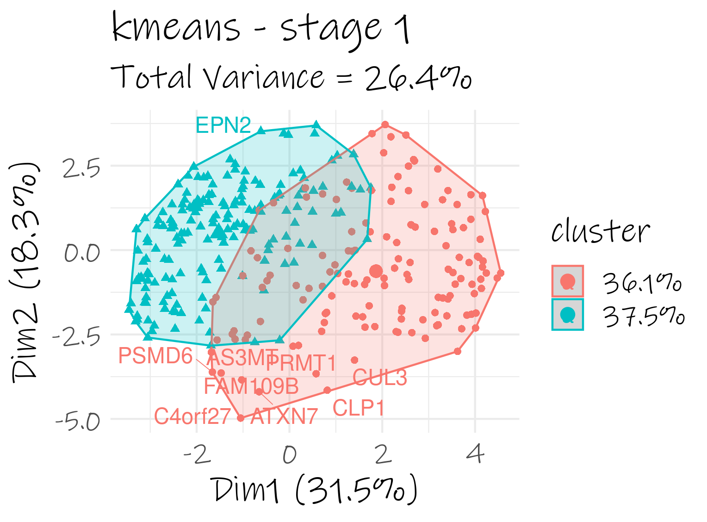
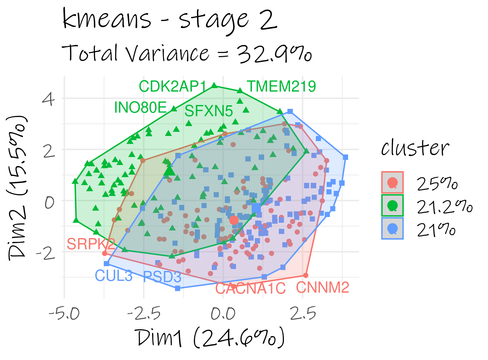
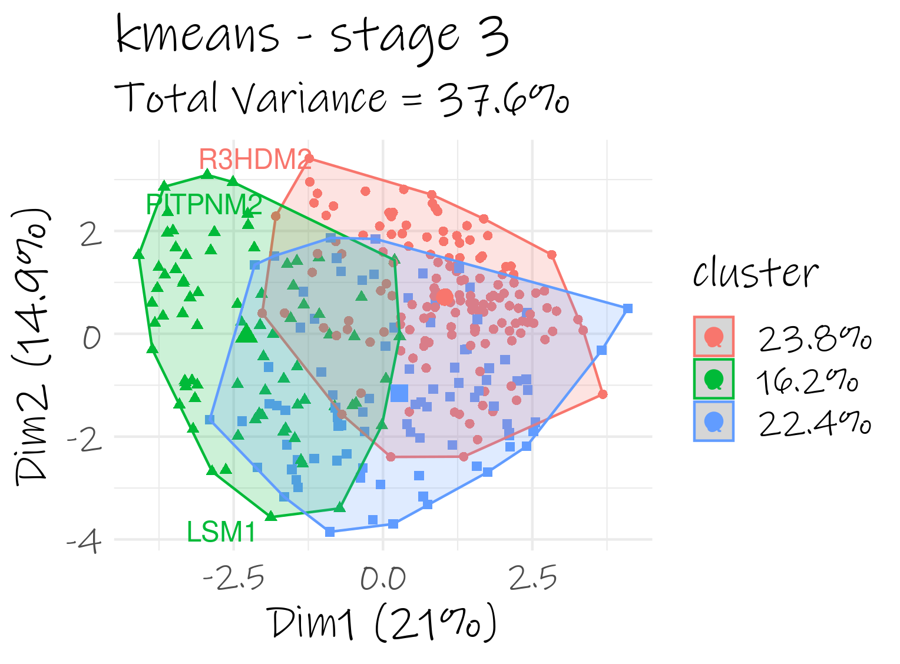
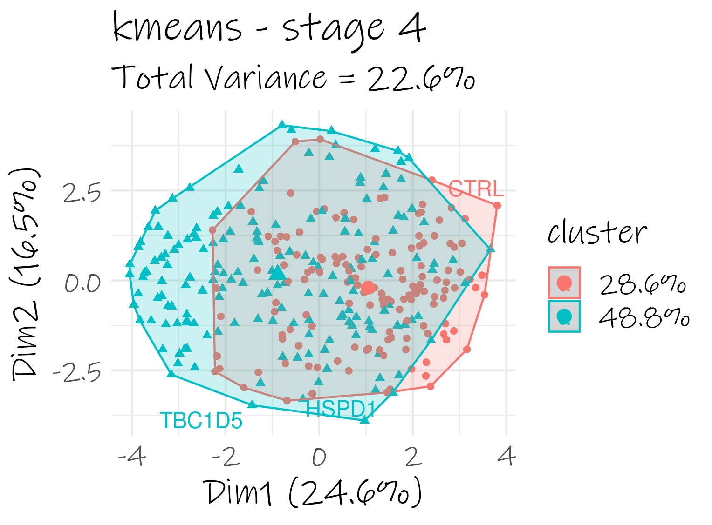
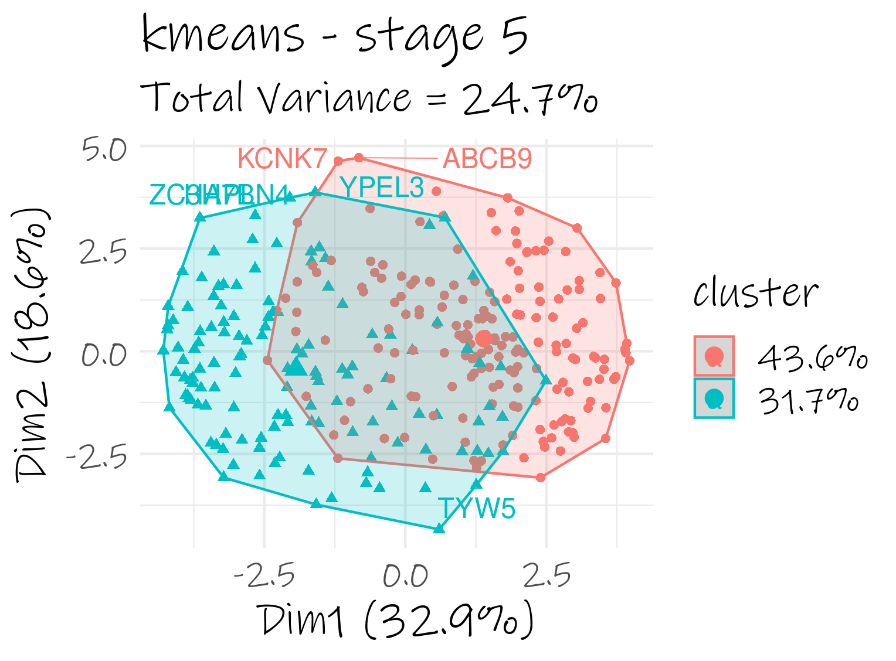

```{r setup, include=FALSE}
knitr::opts_chunk$set(echo = FALSE)

# Learn more about creating websites with Distill at:
# https://rstudio.github.io/distill/website.html

# Learn more about publishing to GitHub Pages at:
# https://rstudio.github.io/distill/publish_website.html#github-pages

```

:::: {style="display: flex;"}

::: {}

## WGCNA

[Stage 1 WGCNA](WGCNA/stage1/wgcna_results-stage1.html)  
[Stage 2 WGCNA](WGCNA/stage2/wgcna_results-stage2.html)  
[Stage 3 WGCNA](WGCNA/stage3/wgcna_results-stage3.html)  
[Stage 4 WGCNA](WGCNA/stage4/wgcna_results-stage4.html)  
[Stage 5 WGCNA](WGCNA/stage5/wgcna_results-stage5.html)  


## kmeans

{width=50%}  
{width=50%}    
{width=50%}  
{width=50%}    
{width=50%}   

:::

::::